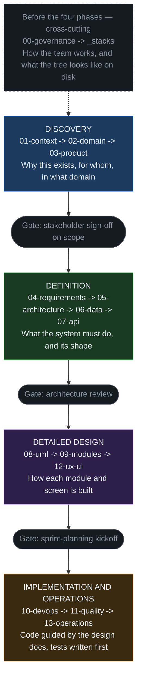

# SDD Guide — Software Design Documentation

> [!NOTE] INSTRUCTIONS
> This is the entry point for the whole repository. Read it before filling in any
> section. It is normal for this file to stay long — it is the one document
> exempt from the 80-line limit that governs everything else here. Delete this
> block once a second person has reviewed the phase order against how the team
> actually works.

## What is SDD?

**Software Design Documentation** is an approach where the design document is
written and reviewed **before** the code that implements it. The document is not
a record of what got built — it is the plan the build follows.

```
Traditional:  Code  ->  Documentation (if it ever happens)
SDD:          Documentation  ->  Code  ->  Updated documentation
```

### The 3 SDD principles

1. **Design before code.** A reviewed design document is the prerequisite for
   starting implementation. If a decision is not written down, it has not been
   made yet — it has only been discussed out loud.
2. **Living documentation.** A document is updated in the same pull request as
   the code it describes. A document that describes old behavior is not merely
   outdated — it is wrong, in exactly the way that code with a bug is wrong.
3. **Traceability.** Every module change traces back to a requirement, every
   requirement traces back to a stakeholder need, and every requirement has at
   least one test that would fail if the requirement stopped being true.

## The four phases

This repository is filled in, section by section, across four phases. Each phase
ends at a gate: a point where a specific person or group has to say yes before
work moves on to the next phase.



The dashed box is not a fifth phase. `00-governance/` is agreed first — it is what
every later section is measured against — and `_stacks/` is chosen with it; both
then apply to all four phases rather than sitting inside one of them.

> **A note on vocabulary.** Every phase above is described in terms of **modules**
> inside one application, never in terms of independently deployed services. A
> module is a folder with a clear boundary and a single owning team; it ships in
> the same build and the same deployment as the rest of the application.

## Recommended fill-in order

| Week | Order | Path | Question it answers |
|---|---|---|---|
| 1 | 1 | `00-governance/` | How does the team work together? |
| 1 | 2 | `01-context/` | What are we building, and for whom? |
| 1 | 3 | `02-domain/` | What are the entities and rules of the business? |
| 2 | 4 | `03-product/` | What is the product vision and the initial backlog? |
| 2 | 5 | `04-requirements/` | What must the system do, measurably? |
| 3 | 6 | `05-architecture/` | How are layers and modules organized? |
| 3 | 7 | `06-data/` | What does the schema of the single database look like? |
| 3 | 8 | `07-api/` | What are the internal and external contracts? |
| 4 | 9 | `08-uml/` | What do the critical flows look like as diagrams? |
| 4 | 10 | `09-modules/` | What does each module contain, own, and expose? |
| 4 | 11 | `12-ux-ui/` | What does the interface look like, screen by screen? |
| 5+ | 12 | `10-devops/`, `11-quality/`, `13-operations/` | How is it built, tested, run, and observed? |

`_stacks/` is not part of the week-by-week order above — it is a cross-cutting
folder you read once, at the very start, to choose the guide matching this
project's language and adopt its folder layout and command conventions before
Week 1 begins.

## Review gates

| Gate | After | Approver |
|---|---|---|
| Scope sign-off | `03-product/` | Stakeholders |
| Architecture review | `07-api/` | Tech lead and team |
| Sprint-planning kickoff | `12-ux-ui/` | Product Owner and team |
| Go / No-Go | Before the first production deploy | Tech lead and Product Owner |

## The living-documentation rule

```
If the code changed but the document did not  ->  the document is broken
If the document says X but the code does Y     ->  the document is a lie
```

Whoever opens the pull request that changes behavior is responsible for updating
the document that describes it, in that same pull request — not in a follow-up.

---

**Related:** [`00-governance/README.md`](./00-governance/README.md) · [`00-governance/documentation-rules.md`](./00-governance/documentation-rules.md)
