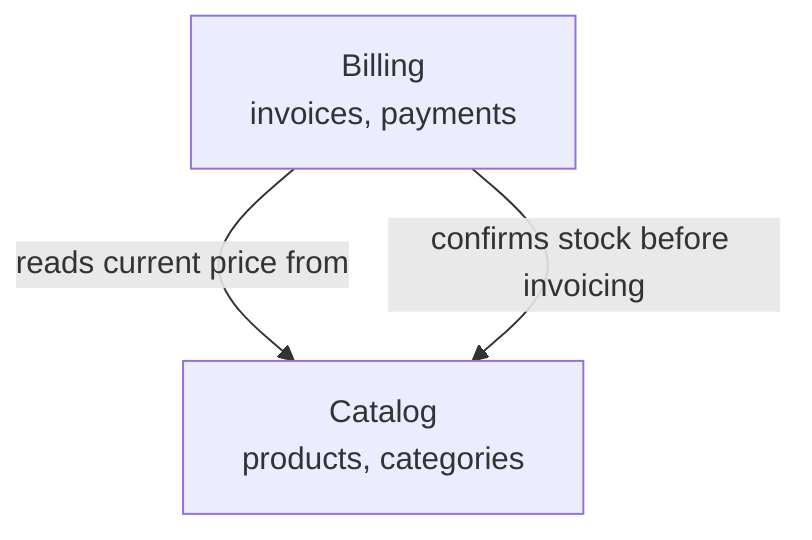

# 02 — Domain Map

> [!NOTE] INSTRUCTIONS
> Draw each bounded context as a box and each relationship as a labeled arrow.
> A context with no relationship to anything else is either wrong or the seed
> of a good module boundary. Delete this block once the diagram matches reality.

## Bounded contexts

## Relationship legend

| Arrow | Meaning |
|---|---|
| `reads current price from` | Read-only lookup; Billing owns no pricing data |
| `confirms stock before invoicing` | Read-only check that runs before an invoice is finalized |

## How this map is used

Every bounded context above becomes exactly one module in
[`module-boundaries.md`](./module-boundaries.md), owning the tables named here.
A context with no box on this map has no reason to be its own module either.

---

**Related:** [`./entities-and-rules.md`](./entities-and-rules.md) · [`./module-boundaries.md`](./module-boundaries.md)
