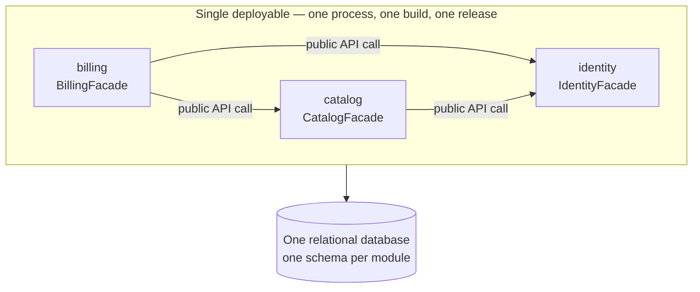

# 05 — Modular Monolith

> [!NOTE] INSTRUCTIONS
> This is the default architecture of this framework — see
> [`ADR-001`](./decisions/records/ADR-001-modular-monolith-as-default.md).
> Replace the example modules with this project's own, copied verbatim from
> `../02-domain/module-boundaries.md`; the names must match, because the
> boundary check reads them. Delete this block once the diagram shows the
> modules this project actually ships.

## What it is

A **modular monolith** is one deployable, built and released as a unit, divided
inside into modules. Each module is a bounded context: it owns its tables,
exposes a narrow public API, and keeps everything else internal. Those three
terms are defined in
[`module-boundaries.md`](../02-domain/module-boundaries.md) and are used here
unchanged.

## One deployment, three modules

`catalog` and `billing` come straight from the domain map. `identity` owns staff
accounts and is the supporting module that answers `NFR-05`; it depends on
nothing, which is what a well-placed boundary looks like. Arrows cross a
boundary only through a public API, and never form a cycle.

## Anatomy of a module

| Part | Rule |
|---|---|
| Public API | One entry point, `<Module>Facade` — the only symbol other modules may import |
| Internal | Domain, application and persistence code; importable only from inside the module |
| Owned tables | Written by this module alone; others read them through the public API |
| Tests | `module-integration` tests exercise the public API; internals are covered by `unit` tests |

## How two modules talk, inside one process

| Mechanism | Use it when | What it is not |
|---|---|---|
| Public API call | The caller needs an answer now, inside the same transaction | Not a network hop — an ordinary in-process method call |
| In-process event | Two or more modules react to something that already happened | Not a broker or a queue — synchronous dispatch, same process, same release |

Both are plain function calls behind a boundary the build enforces. If a call
between modules starts needing a timeout or a retry policy, the boundary is in
the wrong place — the mechanism is not the problem.

## When it applies, and when it is over-engineering

| Situation | Verdict |
|---|---|
| Two or more bounded contexts on the domain map | Modular monolith |
| Two or more people changing unrelated business areas in the same week | Modular monolith |
| A business area that will outlive the current framework or database choice | Modular monolith |
| One bounded context, fewer than ten entities, up to three developers | Over-engineering — use [`layered-architecture.md`](./layered-architecture.md) |
| Boundaries drawn before the domain is understood | Over-engineering — the lines freeze in the wrong place |
| A folder per technical concern, called a module | Not a module at all; that is a layer |

The example in this repository has two bounded contexts, so it is modular. A
project with eight entities in a single context is not a smaller version of
this — flat layers are the right answer there, and switching later is a
documented, expected move, not a failure.

---

**Related:** [`../02-domain/module-boundaries.md`](../02-domain/module-boundaries.md) · [`./boundary-enforcement.md`](./boundary-enforcement.md)
