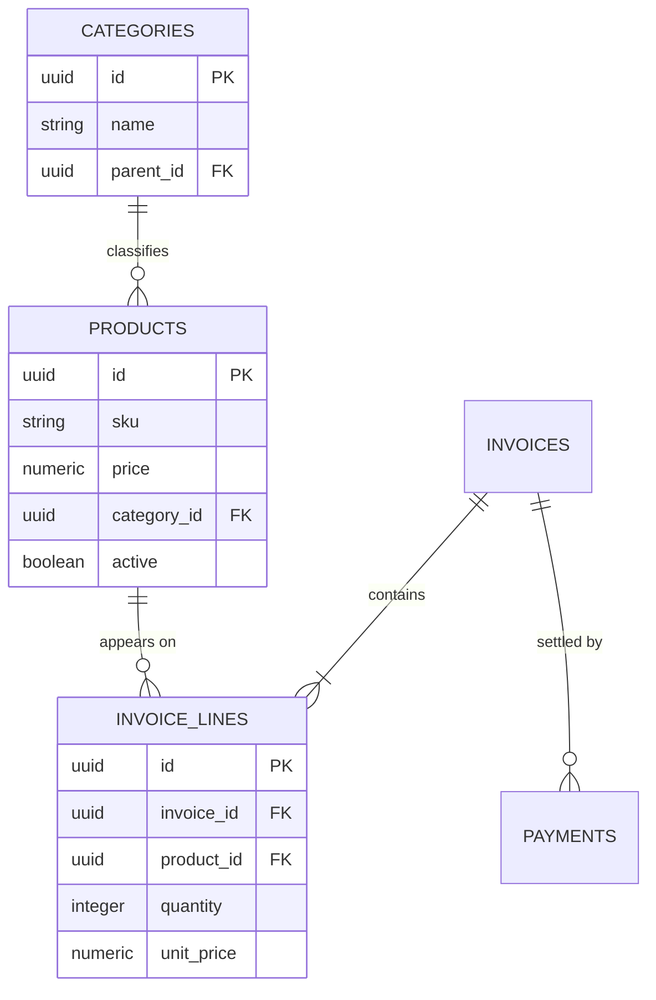

# 06 — Data Models

> [!NOTE] INSTRUCTIONS
> One row per table that survives a restart, sourced from
> `02-domain/entities-and-rules.md` — do not invent a table with no entity
> behind it. Delete this block once the diagram matches the real schema.

## Entities and ownership

| Entity | Table | Owning module | Key attributes |
|---|---|---|---|
| Category | `catalog.categories` | `catalog` | name, parent category (self-referencing, optional) |
| Product | `catalog.products` | `catalog` | sku, name, price, category, active |
| Invoice | `billing.invoices` | `billing` | total, status, issued date |
| Invoice line | `billing.invoice_lines` | `billing` | invoice, product reference, quantity, unit price |
| Payment | `billing.payments` | `billing` | invoice reference, amount, method, recorded date |

Invariants for each entity live in
[`entities-and-rules.md`](../02-domain/entities-and-rules.md); this table
only adds the table name and the module that owns it. Every table here is named
with its schema, following the schema-per-module default in
[`database-conventions.md`](./database-conventions.md) — a project on the
table-prefix fallback writes `catalog_products` instead. The diagram below
names the same tables, without their schema prefix.

## Relationships

## Cross-module references

| Table | Column | Points to | Enforced by |
|---|---|---|---|
| `billing.invoice_lines` | `product_id` | `catalog.products` | `CatalogFacade`, not a database foreign key — see [`database-conventions.md`](./database-conventions.md) |

`invoice_lines.unit_price` is copied from `catalog` at issue time through
`CatalogFacade`, per **BR-02** — it is never read by joining `products` live.

---

**Related:** [`../02-domain/entities-and-rules.md`](../02-domain/entities-and-rules.md) · [`./database-conventions.md`](./database-conventions.md)
