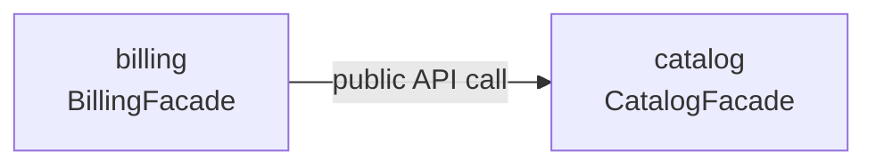

# 09 — Module Catalog

> [!NOTE] INSTRUCTIONS
> One row per module this project actually ships — never a module drawn only
> as an illustrative example elsewhere in this repository. Add a row the
> same day a module is added to
> [`module-boundaries.md`](../02-domain/module-boundaries.md), not after.
> Delete this block once the table matches that file exactly.

## Modules

| Module | Purpose | Owns | Public API | Status |
|---|---|---|---|---|
| `catalog` | Create, price, and retire products and categories | `categories`, `products` | `CatalogFacade` | Stable |
| `billing` | Issue invoices from confirmed orders and record payments against them | `invoices`, `invoice_lines`, `payments` | `BillingFacade` | Evolving |

## Status legend

| Status | Meaning |
|---|---|
| Stable | The public API is safe to build on; a breaking change needs an ADR |
| Evolving | The public API is still gaining methods; expect changes between sprints |

Status describes the public API's own maturity, not whether the module is
running — the application deploys as one unit, so every module here ships
together, on every release, with no address or health check of its own.

## Dependencies between modules

A module with no outgoing arrow depends on nothing else in this catalog; one
with no incoming arrow has no internal consumer yet, which is not a defect.

## Keeping this catalog current

A module earns a row here only after it has one in
[`module-boundaries.md`](../02-domain/module-boundaries.md) and a folder
copied from [`_template-module/`](./_template-module/README.md). A module
dropped from the domain map loses its row here in the same pull request.

---

**Related:** [`../02-domain/module-boundaries.md`](../02-domain/module-boundaries.md) · [`./_template-module/README.md`](./_template-module/README.md)
