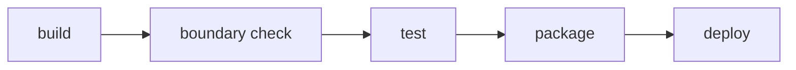

# 10 — CI/CD Pipeline

> [!NOTE] INSTRUCTIONS
> Absorbs the v1.0.0 deployment guide. One pipeline definition, kept in
> this file, is the only path from a commit to any environment — a second
> pipeline for a second artifact would mean this is not a monolith
> anymore. Delete this block once the pipeline has failed on purpose at
> every stage below.

## One artifact, one pipeline

The application builds once, into one deployable artifact, in the
`package` stage below. Staging and production run that same artifact —
never a second build from the same commit — promoted forward through the
stages that follow. There is no per-module pipeline and no deploy order
between modules: the whole application moves together, or not at all.

`boundary check` runs straight after `build` and before `test`, matching
[`boundary-enforcement.md`](../05-architecture/boundary-enforcement.md): a
boundary violation makes the test results that would follow uninteresting,
so the pipeline stops before running them.

## Stages

| Stage | What it does | What makes it fail |
|---|---|---|
| `build` | Compiles the application from source | The code does not compile, or a dependency cannot be resolved |
| `boundary check` | Runs the stack's tool from [`boundary-enforcement.md`](../05-architecture/boundary-enforcement.md) against the whole tree | Any module reaches another module's `internal/` code |
| `test` | Runs the `unit` and `module-integration` layers from [`testing-strategy.md`](../11-quality/testing-strategy.md) | A test fails, or coverage drops below **NFR-07** (80% on changed files, 90% on the `billing` module) |
| `package` | Assembles the one deployable artifact — a container image, executable bundle, or package, per `_stacks/` — and tags it with the commit | The artifact cannot be assembled |
| `deploy` | Promotes the artifact to an environment from [`environments.md`](./environments.md) and runs a smoke test | Staging: the `end-to-end` layer fails. Production: the health check fails, or approval is not granted |

## When each stage runs

| Trigger | Stages that run |
|---|---|
| Every pull request | `build` through `package` — the artifact is built and proven, never deployed |
| Merge to `dev` | All five stages; `deploy` targets `staging` |
| A release tag on `main` | All five stages; `deploy` targets `production`, gated on manual approval |

---

**Related:** [`../05-architecture/boundary-enforcement.md`](../05-architecture/boundary-enforcement.md) · [`../11-quality/testing-strategy.md`](../11-quality/testing-strategy.md)
