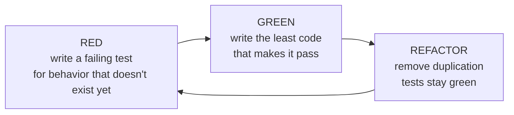

# 11 — TDD Guide

> [!NOTE] INSTRUCTIONS
> This describes a discipline, not a tool — the test runner and mock
> library for this project's stack live in `_stacks/`. Delete this block
> once a reviewer has rejected a pull request for shipping code with no
> red test that came before it.

## Red, green, refactor

Each loop covers one behavior, at one layer from
[`testing-strategy.md`](./testing-strategy.md) — most loops are `unit`,
inside a single module.

## What makes a test good

| Property | What it means here |
|---|---|
| Fast | A `unit` test runs in milliseconds — no database, no other module |
| Isolated | Passes alone or in any order; shares no mutable state with another test |
| Deterministic | Same result every run — no clock, random value, or network call left unstubbed |
| Behavior-named | States the rule under test, not the method called — see the naming convention in `testing-strategy.md` |
| One reason to fail | One assertion path per test; a test that checks two rules hides which one broke |

## Anti-patterns and their fix

| Anti-pattern | Why it fails | Fix |
|---|---|---|
| A `unit` test that starts the whole application to test one function | Slow, and it stops being a `unit` test | Construct the class directly; replace its direct collaborators with test doubles |
| A test that reaches into another module's internal code for setup data | Breaks the same boundary `boundary-enforcement.md` checks in the build | Go through the owning module's public API, the same way a `module-integration` test does |
| Asserting on internal state instead of an observable result | Breaks on refactors that change nothing observable | Assert on the return value, the persisted row, or the event raised |
| Writing the test after the code, to match what it already does | Never fails, so it never proves anything | Write the test first; confirm it fails for the stated reason before writing the code |

---

**Related:** [`./testing-strategy.md`](./testing-strategy.md) · [`../00-governance/definition-of-done.md`](../00-governance/definition-of-done.md)
