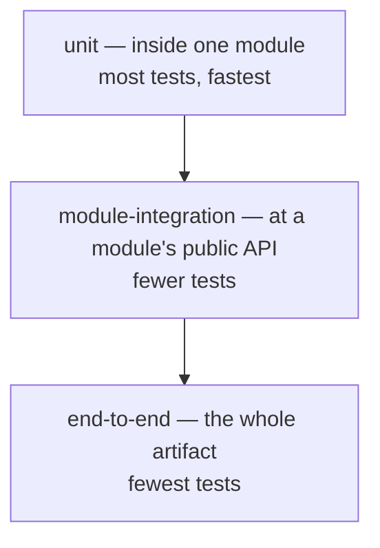

# 11 — Testing Strategy

> [!NOTE] INSTRUCTIONS
> Absorbs the v1.0.0 testing standards. The three layer names below are
> used verbatim by every stack guide in `_stacks/` — do not rename them
> once a second document links to them. Delete this block once the `test`
> stage in `ci-cd.md` enforces the thresholds below in CI, not just here.

## The pyramid, shaped by module boundaries

The middle layer is what makes this pyramid a monolith's, not a generic
one: it verifies, by running code, the same boundary that
[`boundary-enforcement.md`](../05-architecture/boundary-enforcement.md)
verifies statically. A test that reaches into another module's internal
code to set up its scenario is not a `module-integration` test — it is a
`unit` test that broke the boundary it was supposed to respect.

## Layers

| Layer | What it covers | What it does NOT cover | Threshold |
|---|---|---|---|
| `unit` | One class or function inside one module, collaborators replaced by test doubles | The module's own public API surface, the database, any other module | 80% line coverage on changed files, 90% on the `billing` module — **NFR-07** |
| `module-integration` | A module's public API (`CatalogFacade`, `BillingFacade`), called from outside the module, against a real database | Another module's internal code; two modules exercised through a third's API in one test | Every `BR-NN` reachable through a facade has at least one test |
| `end-to-end` | The whole deployable, through its one HTTP API, exactly as `ci-cd.md`'s `deploy` stage runs it | Load and concurrency — that is **NFR-01**, measured separately | Every ⭐-priority `HU-NN` has at least one test |

## Naming a test

`<subject>_<condition>_<expectedResult>` — for example,
`issueInvoice_whenProductRetired_isRejected` for **BR-01**. The name
states the behavior; the assertion proves it. A test named after the
method it calls, not the behavior it checks, gets renamed in review.

## Where each layer runs

`unit` and `module-integration` run in `ci-cd.md`'s `test` stage, on
every pull request. `end-to-end` runs later, in the `deploy` stage,
against the artifact already promoted to staging — see
[`ci-cd.md`](../10-devops/ci-cd.md).

---

**Related:** [`../10-devops/ci-cd.md`](../10-devops/ci-cd.md) · [`../04-requirements/traceability-matrix.md`](../04-requirements/traceability-matrix.md)
