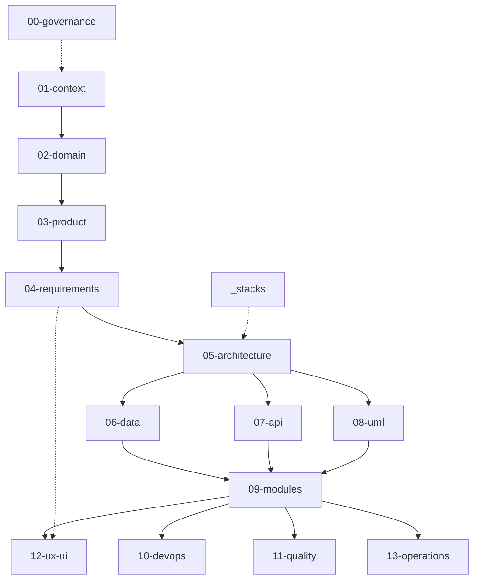

# Monolith Governance Framework

> A Software Design Documentation framework for teams building **one deployable
> application**: fifteen sections saying what to write down, in what order,
> and when each is finished.

**Author:** [Jesus Ariel Gonzalez Bonilla](https://github.com/jesusarielgb-works)

## Scope

- One application, one build, one deployment — organised internally as modules
- Module boundaries drawn in the business language and enforced by the build
- One relational database, with exactly one owning module per table
- One public API surface, one pipeline, one process to observe and operate
- Stack guides for Java/Spring, Node/TypeScript, Python/Django and PHP/Laravel

The growth path this framework supports is **toward the modular monolith**: firmer
boundaries inside the same deployable, not more deployables.

## Out of scope

- Service decomposition and inter-service communication
- Distributed transactions, service mesh, api gateway, service discovery
- Per-service deployment, versioning and release trains
- Resilience patterns for remote calls, such as the circuit breaker or the saga

Distributed-system concerns belong to the
[microservices governance framework](https://github.com/jesusarielgb-works/microservices-governance-framework).

## How to use this framework

1. Read [`00-sdd-guide.md`](./00-sdd-guide.md) — the four phases, their gates, and the
   week-by-week fill-in order.
2. Copy this repository into your project as its documentation root, or fork it.
3. Choose your stack guide in [`_stacks/`](./_stacks/README.md) and adopt its folder
   tree and commands before Week 1.
4. Agree [`00-governance/`](./00-governance/README.md) first — it is what every later
   section is measured against.
5. Fill the remaining sections in the guide's order, one phase at a time.
6. Delete a document's INSTRUCTIONS block only once that document is complete and a
   second person has reviewed it.
7. Update the affected document in the same pull request as the code it describes.

## How the sections depend on each other

A solid arrow means the target section cannot be answered honestly until the source
one is — the order `00-sdd-guide.md` fills them in. A dotted arrow is the weaker
relationship, and covers two cases: a cross-cutting section, read once and applied
throughout (`00-governance`, `_stacks`), or an input that informs a section without
gating its order (`04-requirements` feeding `12-ux-ui`).

## The fifteen sections

| Section | The question it answers |
|---|---|
| [`00-governance/`](./00-governance/README.md) | How does this team plan, branch, review, close and secure its work? |
| [`01-context/`](./01-context/README.md) | Why does this system exist, for whom, and where are its edges? |
| [`02-domain/`](./02-domain/README.md) | What is the business, and where do the module boundaries fall? |
| [`03-product/`](./03-product/README.md) | Where is the product going, and which problem justifies building it? |
| [`04-requirements/`](./04-requirements/README.md) | What must the system do, measurably — and how well? |
| [`05-architecture/`](./05-architecture/README.md) | What internal shape does the single deployable take, and who enforces it? |
| [`06-data/`](./06-data/README.md) | Which module owns which table, and how does the schema change? |
| [`07-api/`](./07-api/README.md) | What does the one public API look like to the clients that call it? |
| [`08-uml/`](./08-uml/README.md) | What do the critical structures and flows look like as diagrams? |
| [`09-modules/`](./09-modules/README.md) | What does each module own and expose, what has it decided, and how is it run? |
| [`10-devops/`](./10-devops/README.md) | How does one build artifact reach each environment, and on what conditions? |
| [`11-quality/`](./11-quality/README.md) | What is tested, at which of the three layers, and written when? |
| [`12-ux-ui/`](./12-ux-ui/README.md) | What keeps the screens consistent with each other? *(skip if there are none)* |
| [`13-operations/`](./13-operations/README.md) | How does the running application show its state, and what happens when it fails? |
| [`_stacks/`](./_stacks/README.md) | What does all of the above look like on disk, in my language? |

## How to cite

> Gonzalez Bonilla, J. A. (2026). *Monolith Governance Framework* (v2.0.0).
> jesusarielgb-works. https://github.com/jesusarielgb-works/monolith-governance-framework

## Contributing

See [CONTRIBUTING.md](CONTRIBUTING.md).

## License

MIT — Jesus Ariel Gonzalez Bonilla. See [LICENSE](LICENSE).
